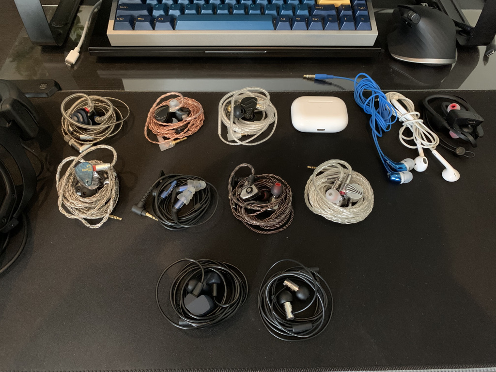

This page presents my IEM collection and my impressions of some other IEMs that I managed to audition. Together, they represent the breadth of my IEM experience. 

Update history:
- 13/03/2022: Downgraded A4000 and E3000, added E5000 and Andromeda 2020 to collection. Added impressions on CFA Solaris 2020.
- 13/02/2022: First version

# Collection

## My favourite / daily drivers

**Final Audio E5000:** This IEM replaces E3000 as my daily driver. It keeps everything that makes E3000 great: warm and realistic sound signature with great sense of depth in the soundstage. E5000 improves upon E3000 in terms of clarity, sub-bass extension, and stereo imaging accuracy. The major drawback of E5000 is how power hungry it is.

**Campfire Audio Andromeda 2020:** My first kilobuck IEM after lots of consideration and comparison. It has a warm, relaxing sound signature and very 3D stereo imaging field. On these fronts, Andromeda is as good as IEM can get. 

**Tanchjim Ola:** Surprising nifty little IEM. Its stereo imaging is stella, not just in its price range, but in the grand scheme of IEMs. 

## Respect but don't daily drive

**Final Audio A4000:** extremely transparent and engaging. Trade blows with kilobucks in technicality and soundstage easily (I did A/B tests). However, it has a thin sound and can become tiresome after several hours of listening.
 
**Final Audio E3000:** when I first started, I hated this IEM because it does not have "neutral and mature tuning like Moondrop". Nowadays, it is my favourite: very warm and smooth, yet detailed and resolving if you pay attention. Its warmth reminds me of some 64 audio pairs somehow.

**Fiio FD5:** used to be by favourite. However, the Final Audio pair ruined FD5 for me by revealing how unrefined the masked the tuning of FD5 is. However, FD5 still has great transient response and can be tamed with foam tips to become a competent IEM. 

**Blessing 2:** very clear, but not engaging. If B2 is a screen, it's the one with low contrast: no pure white, no pure black, just grey-ish. Another problem is its mediocre stereo imaging ability.

**ER2SE:** depending on the insertion depth, you either have insane detail with no soundstage, or average soundstage with meh detail. Isolation is top-notch, though. *Edit: I found that spin-fit two-flange tips are perfect for these IEMs, giving them soundstage without messing up their treble response. I'm still not a fan of the tuning.*

**Dunu Titan S:** It's great. I take it out once in a while, but I prefer my Final Audio pair.

## Not really my cup of tea

**Fiio FH3:** my first "expensive" IEM. I used to fight tooth and nail with anyone who thinks FH3 is not so great. And then other IEMs show me FH3's weaknesses, and I cannot unhear them.

**Moondrop Aria:** smooth tuning, but note attacks are soft and fuzzy. It also has the grey-ish sound of Blessing 2. Still, Aria is still a benchmark against which I review other IEMs, due to how natural it sounds.

**KZ ZSN Pro X:** members on r/HeadphoneAdvice keep asking for upgrade path from this one, so I got one to try. Review is up on this sub.

**Airpods Pro:** It's actual decent. More or less the same problem with Aria: soft, fuzzy, and not very contrasty. The convenience is excellent, though.

**$15 supermarket IEM:** if you think KZ is bad, try this one. I bought this to give me an idea how bad an IEM can be.

**Earpods:** Not that bad. Better than the supermarket IEM.

## Sources

**Fiio KA3:** Nifty little dongle with clean and powerful output. Match in heaven for Final Audio E5000.

**Fiio BTR5:** It works decently as a wireless DAC/AMP. However, it does not fit my use cases well.

**Apple Dongles:** Cheap and convenient. They can drive most IEMs well, except E5000.

# Impressions 

## CFA Solaris 2020
- It's beautiful and well-built.
- It's not that impressive. The bass does not feel impactful yet looser, mushier than CFA Andromeda 2020.
- The impressive sense of depth in the stereo image of Andromda 2020 does not exist on Solaris. 
- I would get Andromeda and E5000 instead of putting all of that money into Solaris.

## Dunu SA6
- It’s beautiful! Crystal clear and chock full of BA drivers inside.
- Excellent accessory, but the cable is humongous. Why would you supply such a thick cable for such small and nimble IEM?
- It locks into my ears very well and completely seal them off against the sound of a hifi system running in the background. I can see why this is a professional monitoring tool.
- The sound is clear and detailed. The degree of detail this IEM extract is in the ballpark with the Andromeda 2020, from memory.
- Elements of the mix are not push apart from each other to create separation like Final A4000/A8000. However you can follow each one easily, even the ones far left and far right of the stereo field.
- Smooth tuning. Very comfortable sound, just like many in the 64 audio line up, the kind of sound that you can sit back and listen for hours with getting tired.
- Drawbacks: does not have a strong sense of layering of sound (elements layering from closer to further away). This is the only thing that I dislike. If I can run this one through my detailed A/B tests against benchmarks , I suspect it would rate very high.

## Dunu Zen Pro
- It’s tiny but well built. Much smaller than what I imagined.
- Beautiful, soft cable.
- Out of the box, I can hear that this is an energetic sound. Not a smooth soft tuning like SA6 but the kind of sound that raises your energy level.
- Bass and drum sound excellent on this one. It has the “slam” with a rumbling decay that I can feel in my throat, so I suspect the bass extends pretty low.
- Elements of the mix are decently separated.
- Details are okay too. Not outstanding like SA6, but perhaps because the showroom was a bit noisy.
- Top-end (ultra high frequency or “air”) is there, but not quite as much as I expected. Again, perhaps due to the noisy showroom.
- Drawback: again, layering. And also the not so extravagant detail and top end. It’s still competitive against things like Vega and Dorado, but Andromeda is looming ahead at only AUD$200 more, so I’m not sure I want to add Zen Pro to my collection as much as SA6.

## Dunu EST112
- Custom-looking IEM, made out of a chunk of metal. Pretty cool.
- Nice cable and accessories, as expected.
- The sound is alright. Nothing jumps out to be outstanding or exciting to be geeking about to me.
- I do expect those EST drivers do something special, but I couldn’t hear that something. Perhaps due to noisy showroom.
- I personally would get SA6.

## Fiio FA7s
- FA7s looks like FD5 but with a different face plate. 
- However, Fiio has slightly tweaked the angle of the nozzle, making FA7s sit flush against the concha of my ear. Very comfortable.
- Warm sound, yet percussion instruments sound firm and "fast".
- FA7s sound more detailed than FD5 and way above FH3.
- Due to the strange ear-gain tuning, the stereo imaging is uncanny on this IEM. The stage is pushed against my face and feels "squeeze" in some how. This is a dealbreaker for me.

## Impressions and thoughts on some TOTL from CFA and 64 Audio
Encounter of TOTL: I have a chance to spend several hours A/B tests my collection against CFA Dorado, Andromeda 2020, Ara, and 64 Audio U6t, U12t, and Tia Fourte. Here are some observations and thoughts for fun:
- Higher price does not necessarily means better sound quality. Think of IEM as a character creation in an RPG. Higher price is like rolling more dice to get more attribute points. However, there is no guarantee that you will actually have more points nor those points would go to the attributes that you actually care about.
- However, you have higher chance of finding outstanding IEMs that suit you in higher price bracket.
- You have no idea what you miss in audio gear, unless you hear the deficit yourself. For example, Andromeda 2020 reveals some midrange detail in familiar test tracks that I have no idea my Blessing 2 and A4000 have been missing. Reviewers can sing praises about Andro, but I would not "get" it until I hear it.
- IEMs do not have to sound loud and thin to reveal detail. Many TOTL are warm, comfortable, yet very revealing (particularly Andro and U12t)
- There are more than detail and clarity. Most 64 audio IEMs, and even Andro to a certain degree, have dynamic contrast: loud sound are louder, silence are more quiet, and the sense of "air" and reverb is apparent. Only a few in my collection can give that dynamic contrast.
- There is a physical limitation on soundstage of IEMs. All of the TOTL, especially Andro and Fourte, are well known for soundstage. However, they are not much different from each other and no larger than A4000, which also uses a bunch of tuning tricks for soundstage. And good speakers in a good room murder all of them.