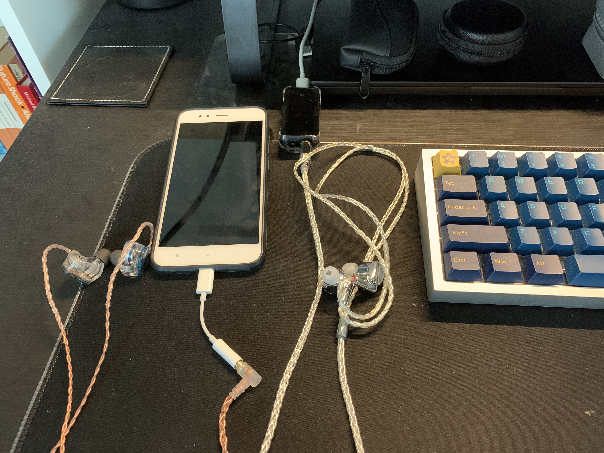
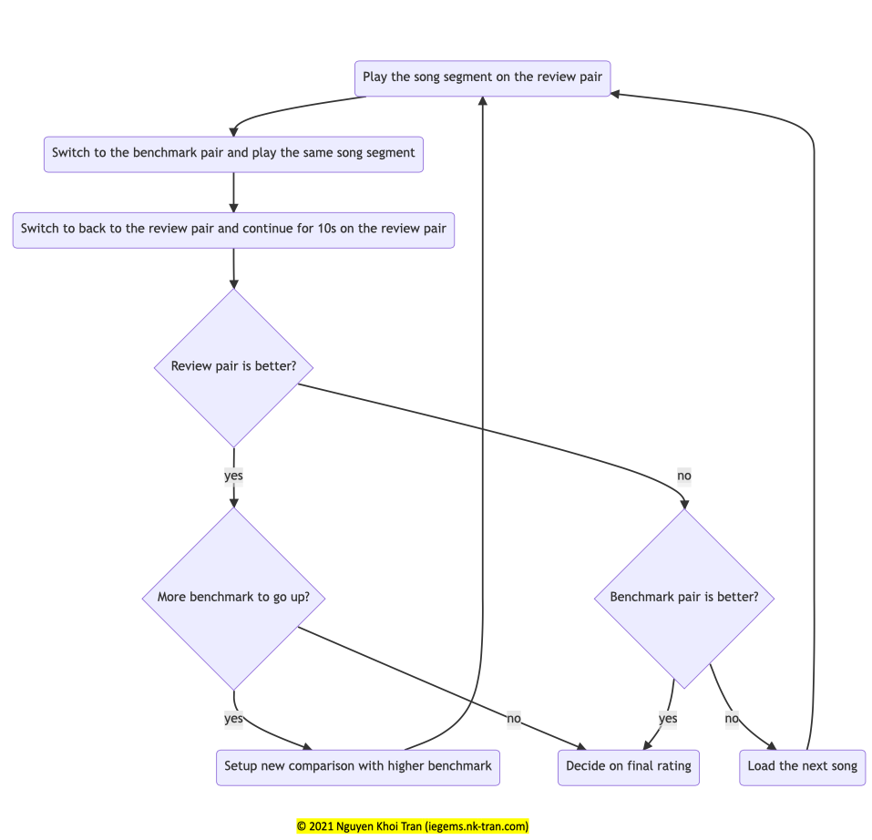
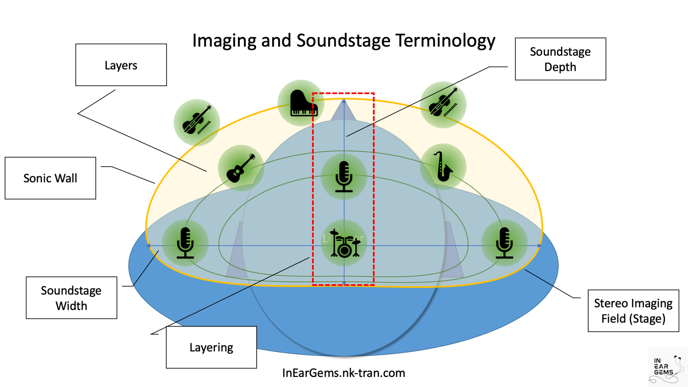
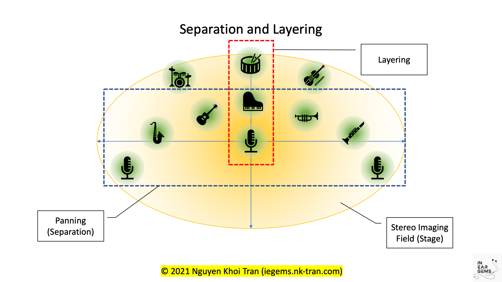

> tl;dr: IEMs are rated by comparing against well-known and well-performing IEMs (Aria, Blessing 2, ER2SE) on a few test tracks. Comparison features include stereo imaging, percussion control, detail, separation, and tonality. Differences between IEMs with the same score is negligible, so get whichever cheaper and ships faster.

*Last update: 13/03/2022*

Oftentimes, we read or watch reviews to know whether a shiny new pair of IEM is worth it comparing to what we already have. Unfortunately, reviews are generally bad at giving this information because they lack a fixed and explicit "ruler" to tell us how good (or bad) an audio product is, comparing to others. An "average IEM" to someone daily driving flagship IEMs can be quite different from an "exceptional IEM" to reviewers who focus on the entry-level market.

Another problem with IEM reviews is obsession with dissecting of tonality or tuning, leading to a negligence of other factors that make an IEM immersive: stereo imaging capability, percussion rendering, separation, detail resolution.

In-Ear Gems aims to address these problems with a review method called **Subjective Benchmark-based Rating**.

## What is Subjective Benchmark-based Rating?

**The benchmark-based rating** means an IEM's score reflects how they compare against well-known and well-performing IEMs rather than against a reviewer's taste and experience. In other words, it can tell you that an IEM resolves details better than Aria but worse than Blessing 2 instead of "average detail" or "good detail for its price".

**Subjective** means the comparison results against benchmarks are based on the reviewer's ear and brain rather than a measuring gig. This is necessary because many factors such as soundstage cannot be measured currently. Noted subjective does not mean preference: the standard of subjective ratings is other IEMs rather than the reviewer's taste.

Does this means this method ignore measurements like frequency response? No. Frequency response captures a lot of information about how an IEM works and thus shouldn't be ignored. I don't use frequency response graphs to assess IEMs, but I do use those measurements to keep myself honest.

### Review Setup

The reviewer uses two listening rigs with comparable sound quality to quickly switch between benchmark and the IEM being reviewed. Rapid switching is critical for comparison because aural memory fades fast.

**Configurations:**
- Apple Music Lossless offline (Macbook) > Fiio KA3 > testing IEM
- Apple Music Lossless offline (Macbook) > Fiio BTR5 > benchmark IEM

**Benchmark IEMs:**

- Updating ...

### Review Procedure

The review process of every IEM starts with daily driving for at least one day, in order for the reviewer to familiarise with the sound ("brain burn-in") and identify any comfort issue.

The actual review comprises multiple A/B tests, starting with the lowest benchmark (Apple EarPods). The procedure is as follows:

Sometimes, you will see impressions posted on In-Ear Gems. Impressions are generally performed on loaned or demo unit under a time constraint. They are carried out similarly to review, but without the daily driving.

## What are the factors of a rating?

### Stereo Imaging and Layering

> **Stereo Imaging** is an IEM's ability to paint an illusion ("image") of a sound field around a listener. This stereo image is achieved by both recording and mixing technique (stereo widening mixing). Given suitable music, movie, or game, IEMs with good stereo imaging allow you to pin point direction of the sound. Exceptional IEMs can recreate a wide and deep image in which instruments and and vocals form *layers* from closer to further rather than existing on a the same flat plane. 

Sage Audio has [an excellent article](https://www.sageaudio.com/blog/mastering/what-is-stereo-imaging.php) that explains stereo imaging better than what I can do. Have a look if you are curious. 

**Test tracks:**
- [Eine kleine Nachtmusik - I. Allegro](https://music.apple.com/au/album/serenade-no-13-in-g-major-k-525-eine-kleine-nachtmusik/1193269208?i=1193270819): Listen for the clear direction of each instrument in the string quartet throughout the piece. You should also be able to hear cello locating closer to than the violin 1.
- [Ruslan and Lyudmila, Act 1: Overture](https://music.apple.com/au/album/serenade-no-13-in-g-major-k-525-eine-kleine-nachtmusik/1193269208?i=1193270819)(0:00 to 1:30): Listen for the layering of orchestra sections. Do instruments seem to come from different distance or meshed together on a flat dome around you? At 1:00, do you hear the cello section very close to your right ears whilst the violin section faded to the distance to your front left?
- [We are the world](https://music.apple.com/au/album/we-are-the-world/41737866?i=41737859)(3:00 onward): This song shows some excellent stereo imaging. Can you hear soloist upfront whilst the choir is pushed further away to the background? Can you hear one choir to the left and further to the back whilst the other to the right and a bit closer to you?

**Rubric**
- **1/5 (train wreck):** Mono sound. No soundstage whatsoever.
- **2/5 (not enjoyable):** Small soundstage with little to no depth.
- **3/5 (good):** Wide soundstage, but depth and layering is lacking.
- **4/5 (great):** IEM either shows exceptional left-right panning (width) but only average depth, or above average depth and layering but not very precise left-right panning.
- **5/5 (exceptional):** IEM has wide and deep soundstage, creating a complex and layered stereo image. Some reviewers might describe this as "holography".

### Percussion Rendering

> **Percussion Rendering** is about the quality of drum hits, bass guitar, and other percussion instruments, not how loud they are. Exceptional IEMs render bass attacks fast, hard, and maintains precise timing regardless of how busy the bass section becomes. On the other hand, poorly controlled bass is boomy (the bass notes linger too long and blend into others) or mushy (the start of bass notes or drum hits are soft rather than decisive). 

This element is somewhat related to the [transient response](https://www.audeze.com/blogs/technology-and-innovation/sensitivity-impedance-and-amplifier-power) of an IEM driver. Frequency response can change the impression by reducing mid-bass and boosting the region around 4-6kHz. However, the key element of successful percussion rendering is an IEM's ability to rapidly jump up and down in terms of loudness. Therefore, exceptional IEMs driven with enough amplifier power can have headshaking bass without becoming boomy.

**Test tracks:**
- [Finale (William Tell Overture)](https://music.apple.com/au/album/finale-william-tell-overture/1443102659?i=1443103644): How rhythmic the whole orchestra sound? Can you follow the drums clearly? How about the rhythm carried by the string and brass section? Can you hear texture and detail in the drum or just mushy thump thump sound?
- [Force your way](https://music.apple.com/au/album/force-your-way/1477136155?i=1477136872): Is the bass line impactful? Can you hear the melody in the bass or just a series of thump thump sound?
- [Clarinet Polka](https://music.apple.com/au/album/clarinet-polka/820700021?i=820700073): fun and chaotic polka. Is the drum clean and precise? Is the clarinet on the right well control? How about the accordion on the left?

**Rubric**:
- **1/5 (train wreck)**: Broken headphones or IEMs with zero bass.
- **2/5 (not enjoyable)**: Boomy, mushy bass that bleeds all over the mix, harming the midrange. 
- **3/5 (good)**: Decent bassline with a physical sensation. However, bass might be a little mushy and might have trouble catching up with complicated basslines. 
- **4/5 (great)**: Fast and well controlled bass that has no trouble catching up with complicated basslines. However, quantity might be lacking, either by having to little midbass or lacking subbass extension.
- **5/5 (exceptional)**: The same control as 4/5 level but with more bass quantity and subbass extension. You can feel the bass hit in your throat.

### Detail Retrieval

> **Detail Retrieval** reflects an IEM's ability to reveal fine details in a mix. Exceptional IEMs are resolving across the frequency spectrum, not just the midrange: you hear more details in the reverb and decay of sound, you hear texture and pitch in the bass, you hear more nuances in instruments and vocal. You usually wouldn't know that your current IEM lacks detail unless you have heard a more resolving one.

**Test tracks:**
- [Hotel California](https://music.apple.com/au/album/hotel-california/1454269663?i=1454269906)
- [My Immortal](https://music.apple.com/au/album/my-immortal/1451784715?i=1451784839)
- [I'm yours](https://music.apple.com/au/album/im-yours/1462825900?i=1462825915)

**Rubric:**
- **1/5 (train wreck)**: Overly smooth with very little detail.
- **2/5 (not enjoyable)**: Some larger details of the mix are presented, but micro-details and nuances in elements are lacking.
- **3/5 (good)**: Adequate amount of details to be enjoyable without feeling lacking.
- **4/5 (great)**: Excellent amount of details, especially in the midrange. Vocal and instruments have great texture and nuances.
- **5/5 (exceptional)**: More revealing than the 4/5 level.

### Separation

> **Separation and Layering** reflects an IEM's ability to prevent elements of a mix from overlapping and mushing together. Separation can happen by spreading elements of a mix from left to right, layering them closer to further away, or by accurate rendering of the timbre of different instruments. Given a decent mix, exceptional IEMs allow you to follow every element of the mix with minimal difficulty.

**Test tracks:**
- [Bad guy](https://music.apple.com/au/album/bad-guy/1450695723?i=1450695739): Can you hear the duplicated vocal line of Billie Eilish on the left? How easy it is for you to follow the words that she sings? 
- [Finale (William Tell Overture)](https://music.apple.com/au/album/finale-william-tell-overture/1443102659?i=1443103644): Can you follow individual sections the orchestra? Can you hear the woodwind playing at the same time with the string section? Can you hear texture and detail in the drum or just mushy thump thump sound?
- [And the waltz goes on](https://music.apple.com/au/album/and-the-waltz-goes-on/1443996822?i=1443996827): How easy it is to separate different sections of the orchestra when the music gets rich and lush from 1:00 onward?

**Rubric:**
- **1/5 (train wreck)**: Mushy mess with no separation.
- **2/5 (not enjoyable)**: There is a certain level left-to-right separation, but layering is almost non-existent.
- **3/5 (good)**: Decent level of separation and layering exists when the mix is not too busy. However, there are still some level of smearing, especially in busy section of a song.
- **4/5 (great)**: Elements of a mix are well separated and layered, unless a song is not mixed with separation in mind. 
- **5/5 (exceptional)** Pin-point separation and layering that is beyond that of 4/5. 

### Tonality

> **Tonality** reflects the timbre and relative loudness of different elements in a mix. The tuning of an IEM can be measured objectively and presented as a frequency response graph. However, the interpretation of tonality from that tuning is more personal due to differences in anatomy, cultural background, and preferences. Therefore, to reduce bias, we assess IEM's tonality based on how bad they are rather than how good they are. As long as the tuning does not make timbre unrealistic nor reduce technical performance significantly, it is okay.

- **1/5 (train wreck):** Tuning causes pain or discomfort.
- **2/5 (not enjoyable):** Unbalanced sound such as a combination between too much bass and too little treble (dark). There might be some timbre issues. EQ is a must. 
- **3/5 (good):** Generally balanced and enjoyable sound. No timbre issue, though there are some tonal imbalance, such as cutting the lower-mid to create artificial separation.
- **4/5 (great):** Great tuning that does not sacrifice lower-mid to create artificial separation. All frequency are presented. However, lower frequencies might be too much on some tracks
- **5/5 (exceptional):** Improved upon 4/5. No EQ is necessary.
  

## FAQs

**Is detail retrieval simply treble?** 
Not really. While more upper mid and treble can push the details forward, I found that one cannot push what is not there. For example, KZ ZSN Pro has a lot of treble energy, yet it does not reveal much detail.

**Is detail same as separation?** 
Not quite. An IEM can cleanly separate elements of a mix without resolving many details. An example of this is Fiio FH3.

**Is separation a function of frequency response?** 
Yes, but FR might not be the only thing that matters.

**How did you establish benchmarks?** 
I identify benchmark IEMs based on their reputation. Benchmark IEMs are A/B tested against each other to establish their relative order.

**Why do you have headphones in your database?**
All the rating factors also apply to headphones, so I add ratings of some headphones for perspective.

**How about measurements? Are you ignoring measurements?**
I do believe that frequency response encodes a lot of important information about how an IEM performs, and I do want to setup a measuring rig in the future. For now, I rely on measurements by other reviewers to cross-reference what I hear with what an IEM measures. 

**How does a 5/5 IEM sound like?**
It would have energetic tuning yet keeping the midrange clear. All frequencies are well presented. It would place elements of a mix in a small dome around a listener's head with pin point precision. The bass would hit hard and fast with plenty of rumble, yet does not lose composure when the music gets crowded.