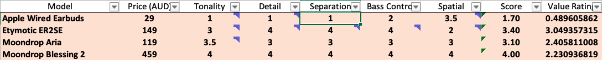

> tl;dr: IEMs are rated by comparing against well-known and well-performing IEMs (Aria, Blessing 2, ER2SE) on bass control, detail, separation and layering, spatial, and tonality. Differences between IEMs with the same score is negligible, so get whichever cheaper and ships faster.

Why do we read or watch IEM reviews?

Sometimes, we do to catch up with the latest hype or hear people nitpicking expensive models. Other times, we read or watch reviews to know *whether a shiny new pair of IEM is worth it, especially compared to what we already have.*

Unfortunately, reviews are usually bad at telling how good an audio product is because they are based on reviewers' preference, experience, and standard, which are not always fixed and explicit. An "average IEM" to someone daily driving flagship IEMs can be quite different from an "exceptional IEM" to reviewers who focus on the entry-level market.

Another problem is that you cannot know whether that shiny pair of IEM improves upon your existing ones in the ways you want. For example, would that IEM with "excellent soundstage" be better than yours, which also has "excellent soundstage" according to the review that drove you to buy it?

In-Ear Gems aims to address these problems with a review method called **Subjective Benchmark-based Rating**. What is it, and how does it help? Read on to find out.

## What is Subjective Benchmark-based Rating?

The benchmark-based rating means an IEM's score reflects how they compare against well-known and well-performing IEMs rather than against a reviewer's taste and experience. In other words, it can tell you that an IEM resolves details better than Aria but worse than Blessing 2 instead of "average detail" or "good detail for its price". Suppose you have an Aria, a Blessing 2, or something comparable. In that case, you will know precisely whether that new IEM meets your requirements.

Subjective means the comparison results against benchmarks are based on the reviewer's ear and brain rather than a measuring gig. This is necessary because many factors such as soundstage cannot be measured currently. Noted subjective does not mean preference: the standard of subjective ratings is other IEMs rather than the reviewer's taste.

Does this means this method ignore measurements like frequency response? No. Frequency response captures a lot of information about how an IEM works and thus shouldn't be ignored. I don't use frequency response graphs to assess IEMs, but I do use those measurements to keep myself honest. 

## What are the factors of a rating?

### Bass Control
**Bass Control** is about the quality of bass, not how loud it is (quantity). Well-controlled bass hits fast, hard, and maintains precise timing regardless of how busy the bass line becomes. On the other hand, poorly controlled bass is boomy (the bass notes linger too long and blend into others) or mushy (the start of bass notes is slow rather than decisive). IEMs with exceptional bass offer quality and quantity, giving the music a strong sense of rhythm and excitement.

- **1/5 (train wreck)**: Broken headphones or IEMs with zero bass.
- **2/5 (not enjoyable)**: Boomy, mushy bass that bleeds all over the mix, harming the midrange. 
- **3/5 (good)**: Decent bassline with a physical sensation. However, bass might be a little mushy and might have trouble catching up with complicated basslines. 
- **4/5 (great)**: Fast and well controlled bass that has no trouble catching up with complicated basslines. However, quantity might be lacking.
- **5/5 (exceptional)**: The same control as 4/5 level but with more bass quantity.

### Detail Retrieval
**Detail Retrieval** reflects an IEM's ability to reveal fine details in a mix. IEMs with great detail give voices and instruments texture and nuance. They also show more elements such as the backing vocal, string ensemble in the background, and reverbs. IEMs that lack detail make all elements of the mix overly smooth. You usually wouldn't know that your current IEM lacks detail unless you have heard a more resolving one.

- **1/5 (train wreck)**: Overly smooth with very little detail.
- **2/5 (not enjoyable)**: Some larger details of the mix are presented, but micro-details and nuances in elements are lacking.
- **3/5 (good)**: Adequate amount of details to be enjoyable without feeling lacking.
- **4/5 (great)**: Excellent amount of details, especially in the midrange. Vocal and instruments have great texture and nuances.
- **5/5 (exceptional)**: More revealing than the 4/5 level.

### Separation and Layering

**Separation and Layering** reflects an IEM's ability to prevent elements of a mix from overlapping and mushing together. Separation is about fanning out elements left to right. Layering is about fanning out elements from front to back. IEMs with excellent separation and layering create a clear, organised, and 3D soundstage.

- **1/5 (train wreck)**: Mushy mess with no separation.
- **2/5 (not enjoyable)**: There is a certain level left-to-right separation, but layering is almost non-existent.
- **3/5 (good)**: Decent level of separation and layering exists when the mix is not too busy. However, there are still some level of smearing, especially in busy section of a song.
- **4/5 (great)**: Elements of a mix are well separated and layered, unless a song is not mixed with separation in mind. 
- **5/5 (exceptional)** Pin-point separation and layering that is beyond that of 4/5. 

### Spatial Illusion

**Spatial Illusion** reflects an IEM's ability to create a stereo imaging field (a.k.a. soundstage) around a listener. Noted that soundstage is an illusion that your brain creates based on the cues in the music itself. IEMs can influence this illusion with tuning tricks, reverb chamber, and open-back design. A soundstage has width, depth, height, and centre. Great IEM soundstage is broad and deep, with the centre shifted forward, giving the illusion that sound comes from a bubble outside a listener's head.

- **1/5 (train wreck):** Mono sound. No soundstage whatsoever.
- **2/5 (not enjoyable):** Small soundstage with little to no depth. Imaging mostly inside the head.
- **3/5 (good):** Wide soundstage with some depth. Imaging can sometimes be outside the head.
- **4/5 (great):** Wide soundstage with noticeable depth and height. Imaging is generally outside the head. 
- **5/5 (exceptional):** Wide and round soundstage like open-back headphones. Generally unreachable by IEMs.

### Tonality
**Tonality** reflects the timbre and relative loudness of different elements in a mix. The tuning of an IEM can be measured objectively and presented as a frequency response graph. However, the interpretation of tonality from that tuning is more personal due to differences in anatomy, cultural background, and preferences. Therefore, to reduce bias, we assess IEM's tonality based on how bad they are rather than how good they are. Excellent tonality can be either Harman neutral, DF neutral, or well-controlled V-shape. As long as the tuning does not make timbre unrealistic nor reduce technical performance significantly, it is okay.

- **1/5 (train wreck):** Tinny sound as if a whole part of the frequency is missing or ear-piecing that is physically uncomfortable to listen. Timbre issues are obvious. Cannot be saved by EQ.
- **2/5 (not enjoyable):** Unbalanced sound such as a combination between too much bass and too little treble (dark). There might be some timbre issues. EQ is a must. 
- **3/5 (good):** Generally balanced and enjoyable sound. No timbre issue, though there are some tonal imbalance. EQ is recommended but not necessary.
- **4/5 (great):** Great balanced tuning or well-controlled V-shape. No EQ is necessary.
- **5/5 (exceptional):** Exceptional tuning that is energetic without sacrificing midrange details nor being overly bright. No EQ is necessary.

## Review Setup

The reviewer uses two listening rigs with comparable sound quality to quickly switch between benchmark and the IEM being reviewed. Rapid switching is critical for comparison because aural memory fades fast.

**Configurations:**
- Spotify offline (Macbook) > BTR5 > testing IEM
- Spotify offline (Mi A1) > Apple Dongle > benchmark IEM

**Benchmark IEMs:**

**Playlist:**

The following [playlist](https://open.spotify.com/playlist/2ztbhO4qujkTRYY9JvLJFP?si=85a3dcfc98f34543) is used for assessing different factors of an IEM.

**Detail:**
- [I have a dream - remix](https://open.spotify.com/track/27MwRZAo8jDXfdHFx8E6cX?si=b013815e147a4810) (0:50 to 1:20): focusing on small elements and backing vocal in the background of the mix.
- [Memories](https://open.spotify.com/track/0PezhWEYlDODxIAKefyINk?si=942f4efd10364c21) (0:00 - 0:21): focusing on the texture and micro-details of the guitar.
- [My Heart Will Go On](https://open.spotify.com/track/33LC84JgLvK2KuW43MfaNq?si=a559df67fdd143b2) (0:00 to 0:40): focusing on the texture and micro-details of the voice, especially the last words of each phrase.

**Separation and Layering:**
- [And the waltz goes on](https://open.spotify.com/track/6gvQHafvp7j7eanVD269Jj?si=b23ed34b8e7840f3) (0:50 - 0:15): focus on the layering and separation of instrument.
- [Beethoven Symphony No. 5 Mvmt 1](https://open.spotify.com/track/4mw5oRBKNBfNV0dXAOIcne?si=dfd0770f575a4307) (0:00 to 0:30): focus on the sharpness of instruments, layering of woodwind over string, and the panning of string from right to left channel.
- [Waltz 2](https://open.spotify.com/track/0pjCsB0XNSyqM9UazlTODC?si=1d2977189fbf446a) (0:35 - 1:00): focus on the separation and layering of woodwind over string over percussion.

**Bass Control**
- [MS Gundam: Iron-blooded Orphans](https://open.spotify.com/track/4VrKSDOKLD9dRkeLScYfPD?si=77b3b26533e9472d) (1:10 to 1:35): focus on the timing and composure of the bass line during busy section.
- [INFINITY](https://open.spotify.com/track/2ws1dIEMyUCNiqoB0tIyXw?si=58852728badb4342) (0:40 to 1:05): focus on the timing of bass and cymbal.
- [Imperial March](https://open.spotify.com/track/7dO9OAZUF4LIK5iZ1gROW3?si=f2643c07408d484a) (0:00 to 0:45): focus on the timing of percussion and double bass.

**Spatial**
- [Danger Zone](https://open.spotify.com/track/34x6hEJgGAOQvmlMql5Ige?si=df966c1603864c67) (0:00 - 0:50): focus on center of soundstage to see how much it is push away from the head.
- [Presto](https://open.spotify.com/track/5jWKziVgN8Bq1Mjrw9hbUt?si=bb3a3fd523ff420f) (0:00 to 0:40): focus on the reverb. Does it wrap around the head or appear inside the head?
- [Shaker test](https://open.spotify.com/track/2ichfXkILYFJEhk0z8ULAm?si=55e977db2576477d): for drawing out the overall shape of soundstage.

## Review Procedure

The review process of every IEM starts with daily driving for at least one day, in order for the reviewer to familiarise with the sound ("brain burn-in") and identify any comfort issue.

The actual review comprises multiple A/B tests, starting with the lowest benchmark (Apple EarPods). The procedure is as follows:

Sometimes, you will see impressions posted on In-Ear Gems. Impressions are generally performed on loaned or demo unit under a time constraint. They are carried out similarly to review, but without the daily driving.
  

## FAQs

**Is detail retrieval simply treble?** 
Not really. While more upper mid and treble can push the details forward, I found that one cannot push what is not there. For example, KZ ZSN Pro has a lot of treble energy, yet it does not reveal much detail.

**Is detail same as separation?** 
Not quite. An IEM can cleanly separate elements of a mix without resolving many details. An example of this is Fiio FH3.

**Is separation a function of frequency response?** 
I suspect so. Preventing bass from bleeding into the mid can give a more transparent "background, " allowing you to clearly hear the boundary between elements.

**How did you establish benchmarks?** 
I identify benchmark IEMs based on their reputation. Benchmark IEMs are A/B tested against each other to establish their relative order.

**Why do you have headphones in your database?**
All the rating factors also apply to headphones, so I add ratings of some headphones for perspective.

**How about measurements? Are you ignoring measurements?**
I do believe that frequency response encodes a lot of important information about how an IEM performs, and I do want to setup a measuring rig in the future. For now, I rely on measurements by other reviewers to cross-reference what I hear with what an IEM measures. 

**How does a 5/5 IEM sound like?**
It would have energetic tuning yet keeping the midrange crystal clear. It would place elements of a mix in a small dome around a listener's head with pin point precision. The bass would hit hard and fast with plenty of rumble, yet does not lose composure when the music gets crowded.